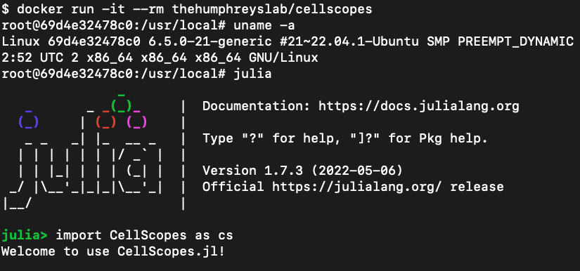
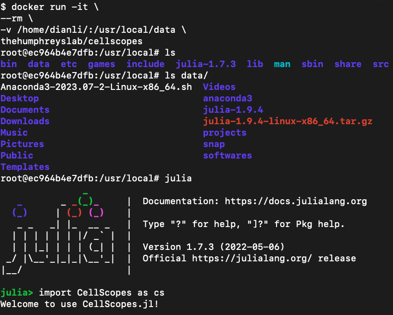
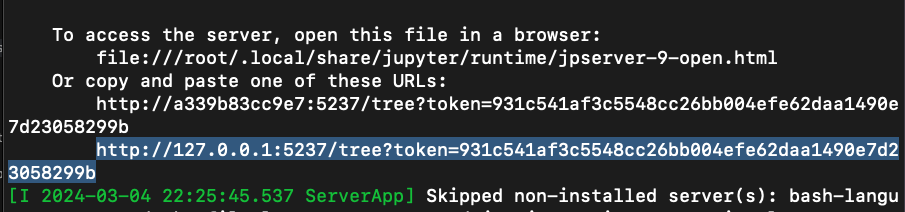
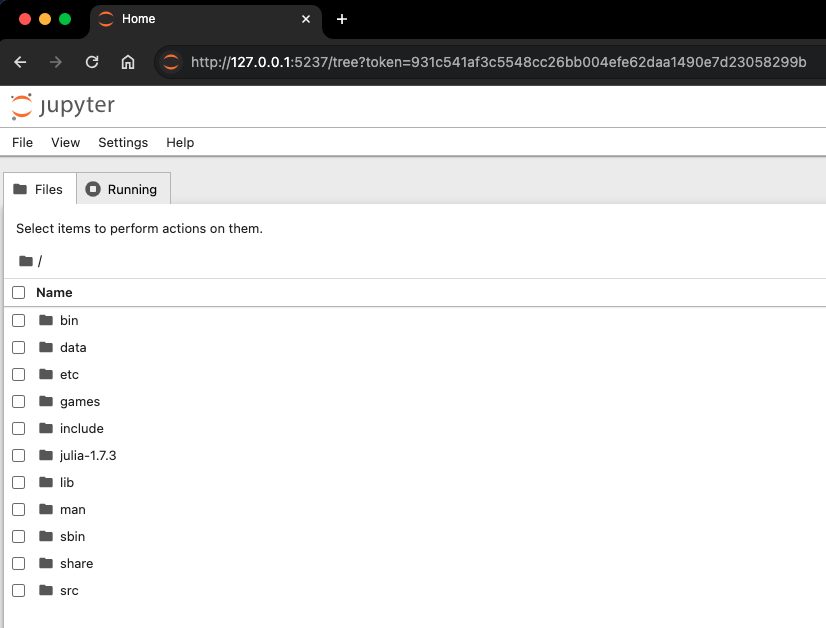
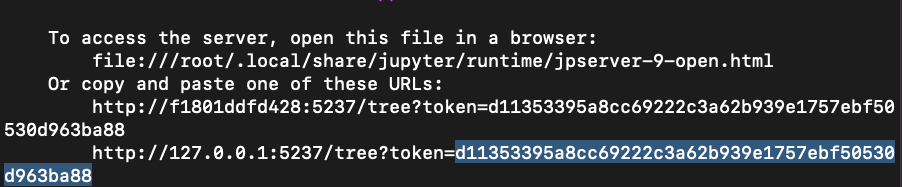
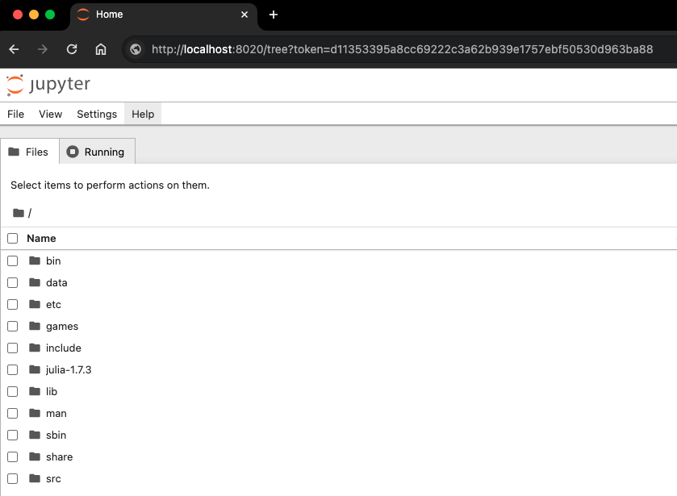

# CellScopes Docker Installation notes
Updated: March 4th, 2024\
OS_1: 22.04.1-Ubuntu x86_64\
OS_2: macOS Monterey 12.7.3\
Julia Version: 1.7.4\
CellScopes Version: CellScopes.jl v1.0.0\
Contact: Dian Li

- [CellScopes Docker Installation notes](#cellscopes-docker-installation-notes)
  - [Part 0. Introduction](#part-0-introduction)
  - [Part 1. Install Docker on Ubuntu (OS\_1)](#part-1-install-docker-on-ubuntu-os_1)
  - [Part 2. Pull CellScopes Docker Image](#part-2-pull-cellscopes-docker-image)
  - [Part 3. Run CellScopes in Docker](#part-3-run-cellscopes-in-docker)
    - [Option 1. Directly load CellScopes in OS\_1](#option-1-directly-load-cellscopes-in-os_1)
    - [Option 2. Directly load CellScopes in OS\_1 and mount a volume for data access](#option-2-directly-load-cellscopes-in-os_1-and-mount-a-volume-for-data-access)
    - [Option 3. Remotely load CellScopes in OS\_1 via Jupyter Notebook from OS\_2](#option-3-remotely-load-cellscopes-in-os_1-via-jupyter-notebook-from-os_2)
      - [Three port numbers](#three-port-numbers)
      - [Port 5237 was predefined](#port-5237-was-predefined)
      - [Connect via Jupyter Notebook](#connect-via-jupyter-notebook)

## Part 0. Introduction

<span style="color:red">*WARNING: sudo is required for installation* </span>

- The Docker installation in this notes was tested on both Mac and Ubuntu operating systems.
- **Sudo access is necessary for installation**.
- OS_1 (remote) serves as the host for the <a href="https://hub.docker.com/r/thehumphreyslab/cellscopes" target="_blank">CellScopes Docker image</a>
- While OS_2 (optional and potentially the same as OS_1) is utilized for accessing <a href="https://github.com/HaojiaWu/CellScopes.jl" target="_blank">CellScopes</a> through Jupyter Notebook.

## Part 1. Install Docker on Ubuntu (OS_1)

- Please refer to the <a href="https://docs.docker.com/engine/install/ubuntu/" target="_blank">Docker website</a> for guidance. 

## Part 2. Pull CellScopes Docker Image

- The <a href="https://hub.docker.com/r/thehumphreyslab/cellscopes" target="_blank">CellScopes Docker image</a> can be found at the Docker Hub website. 

- To pull the image

```
sudo docker pull thehumphreyslab/cellscopes
```

## Part 3. Run CellScopes in Docker

### Option 1. Directly load CellScopes in OS_1

To begin with, CellScopes can be directly loaded within the Docker container:

```
$ docker run -it --rm thehumphreyslab/cellscopes
```

Inside the container, enter julia interactive mode by typing 'julia':
```
root@xxxxxxx:/usr/local# julia
```

Inside julia interactive mode, import CellScopes by:
```
julia> import CellScopes as cs
```

Here is a snapshot for the operations mentioned above




### Option 2. Directly load CellScopes in OS_1 and mount a volume for data access

To connect a directory on OS_1 with the Docker container, we can:

```
docker run -it \
--rm \
-v /Directory_To_Mount:/usr/local/data \
thehumphreyslab/cellscopes
```

The data stored on OS_1 could be accessed via */usr/local/data/* inside the container.

The rest of the procedures are the same as in Option 1.

Here is a snapshot for the operations mentioned above



### Option 3. Remotely load CellScopes in OS_1 via Jupyter Notebook from OS_2

In some cases, we might need to remotely access the CellScopes Docker container from a second machine OS_2.

Option 3 is inspired by <a href="https://hackmd.io/@edinhon/BkvdVGDeP" target="_blank">this tutorial written by edinhon</a>.

#### Three port numbers

To begin with, we describe the meaning for 3 ports to be used for this connection

- port2:5237
  - Port reserved on the remote machine OS_1 to convey information among the Docker container, OS_1, and OS_2
- port3:5237
  - Port predefined in the Docker container to communicate with OS_1
- port4:8020
  - Port reserved on the local machine OS_2 to communicate with OS_1. Examples of OS_2 can be your personal Mac or Windows laptops. The value 8020 can be changed to others depending of the available ports on OS_2 

#### Port 5237 was predefined

To be noted, port 5237 was predefined when the CellScopes Docker container was built. If it conflicts with the port 5237 on your machine OS_1, where the Docker image is installed, please send a request to us. We are happy to provide a Docker image with an alternative port reserved.

#### Connect via Jupyter Notebook

Here are the code for making the connection

```
### assume your account on OS_1 is
### doe@10.10.1.1

### On OS_1
docker run -it \
--name cellscopes \
--rm \
-p 5237:5237 \
-v /Directory_To_Mount/:/usr/local/data \
thehumphreyslab/cellscopes
```

**/Directory_To_Mount/** is the directory on OS_1 where data is stored.

After entering the Docker container, start a new Jupyter Notebook by

```
### inside Docker container
jupyter notebook --ip 0.0.0.0 --port=5237 --no-browser --allow-root
```

<span style="color:green">**If OS_1 and OS_2 are on the same machine that equips with a web browser**</span>.

Then directly copy the html link together with the token in the Jupyter Notebook prompt, and paste to a browser to open it.

Here are snapshots of creating a Jupyter Notebook connection when OS_1 and OS_2 are indeed the same machine:






<span style="color:red">**If OS_2 is a different machine than OS_1 that equips with a web browser**</span>.

First, start to listen to port 8020 on OS_2. Values other than 8020 are also workable.

```
lsof -ti:8020 | xargs kill -9
ssh -NfL 8020:localhost:5237 doe@10.10.1.1
```

Second, copy the token shown in the Jupyter Notebook prompt, and paste to a browser using this IP address:

```
http://localhost:8020/tree?token=The_Token_Copied_From_Jupyter_Notebook
```

Then it should work!

Here are snapshots of creating a Jupyter Notebook connection when OS_1 and OS_2 are different machines:






**[END]**
